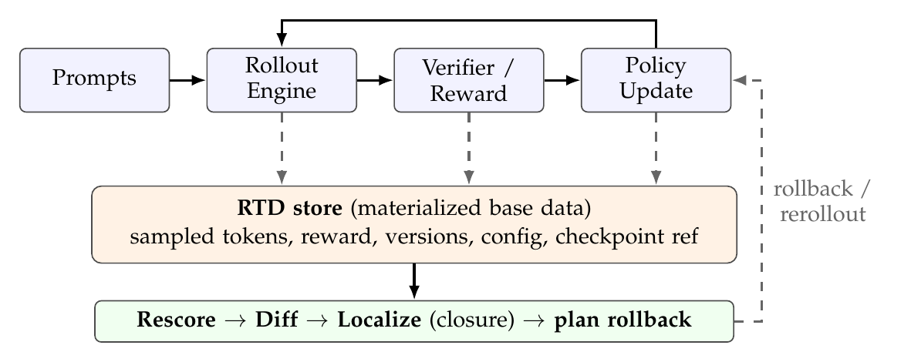
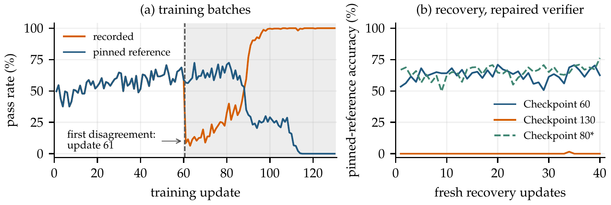
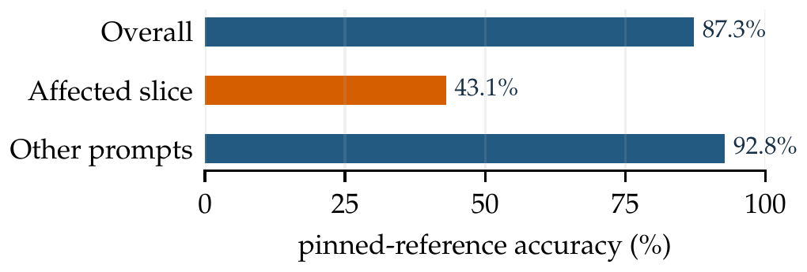

<div align='center'>

# Replayable Trajectory Dataflow: Auditing Reward Measurement under Optimization and Drift in RLVR

[](https://aimslab.stanford.edu/workshop)
[](./paper/RTD-AIMS-COLM2026.pdf)
[](../../issues)
[](./LICENSE)
[](https://www.python.org/)
[](../../stargazers)

</div>

<table align="center">
  <tr>
    <td align="center">
      
      <br>
      <em style="font-size: 11px;"><strong style="font-size: 11px;">Figure 1:</strong> RTD materializes evidence (dashed) from the rollout, verifier, and update stages. Rescore / diff / localize query the store to diagnose a measurement failure and select a rollback checkpoint that the loop re-runs from.</em>
    </td>
  </tr>
</table>

This is the official code repository for the AIMS @ COLM 2026 workshop paper [**Replayable Trajectory Dataflow: Auditing Reward Measurement under Optimization and Drift in RLVR**](./paper/RTD-AIMS-COLM2026.pdf) by Zepeng Zhang (The University of Osaka).

In reinforcement learning with verifiable rewards (RLVR), the verifier is a measurement instrument inside the training loop: policies can exploit a flawed verifier, and verifier changes can silently alter the objective. Checkpoints preserve state and aggregate metrics can hide failures, but neither tells you **which historical measurements shaped which update**.
**RTD** retains the trajectory evidence that re-sampling cannot reconstruct and links versioned rewards to the updates and checkpoints they influenced. Given a corrected reference, three offline queries (**rescore**, **diff**, **localize**) find the historical disagreements and a rollback boundary, **with no new rollouts**.

## News

- 📢 [Oct 2026] Camera-ready paper, code, and the VeRL/MATH incident evidence are released.
- 🎉 [2026] RTD was accepted to the **AI Measurement Science (AIMS) Workshop at COLM 2026** (non-archival).

## Table of Contents

- [Three Queries](#three-queries)
- [Installation](#installation)
- [Quick Start](#quick-start)
- [How It Works](#how-it-works)
- [Capture from a Training Loop](#capture-from-a-training-loop)
- [Paper Results](#paper-results)
- [Reproducing the Paper](#reproducing-the-paper)
- [Scope and Limits](#scope-and-limits)
- [Repository Layout](#repository-layout)
- [Cite This Work](#cite-this-work)

## Three Queries

| Operation | Answers | Needs | New rollouts |
|---|---|---|:---:|
| `rescore` | What would the pinned reference report on these stored outputs? | store + reference | 0 |
| `diff` | Which recorded measurements disagree with that reference? | recorded signals + rescored values | 0 |
| `localize` | Which updates and later training states depend on the mismatches? | lineage graph | 0 |
| `plan_recovery` | What is the latest saved checkpoint before the affected window? | closure + saved checkpoints | 0 |

| | Keeps model state | Keeps consumed outputs and versioned rewards | Per-trajectory lineage to updates | Offline rollback planning |
|---|:---:|:---:|:---:|:---:|
| Checkpoints only | ✓ | ✗ | ✗ | ✗ |
| Aggregate metrics / logs | ✗ | ✗ | ✗ | ✗ |
| **RTD** | ✓ (references) | **✓** | **✓** | **✓** |

## Installation

```bash
git clone https://github.com/PeterWrighten/rtd.git
cd rtd

python3 -m venv .venv
source .venv/bin/activate
python -m pip install -e '.[test]'
```

Python 3.9+. The runtime uses only the Python standard library: no GPU and no model download.

## Quick Start

```bash
python examples/verifier_regression.py
python -m pytest -q
```

```text
Trajectories:           80
Measurement mismatches: 23
First affected update: 18
Rollback checkpoint:   15
Affected updates:      23
New diagnostic rollouts: 0
```

The example captures a synthetic 40-update history, switches to a substring-based verifier at update 18, and queries the retained evidence. It performs **no model training** and is not a reproduction of the paper's empirical results. To keep the JSONL records and print the complete recovery plan:

```bash
python examples/verifier_regression.py --store runs/demo --json
```

The supplied directory must be empty or new. Checkpoint paths in this synthetic example are illustrative; it does not write model weights.

As a library, on an existing capture:

```python
import rtd

store = rtd.open_store("runs/demo")

def corrected_verifier(trajectory):
    return float(trajectory.response == str(trajectory.ground_truth))

rescored = rtd.rescore(store, corrected_verifier, reference_id="exact-v1")
mismatches = rtd.diff(store, rescored)
graph = rtd.LineageGraph.build(store)
closure = rtd.localize(graph, mismatches)
plan = rtd.plan_recovery(graph, closure, reference_id="exact-v1")
print(plan.to_dict())
```

`diff` defaults to pass/fail disagreement at 0.5. For scalar-value differences, supply `predicate=rtd.value_predicate(tol=1e-6)`. Give changed references a new `reference_id`. Rescore caches assume a fixed store snapshot; set `use_cache=False` if records have been appended since the last query.

## How It Works

RTD records a run as a lineage graph over trajectories, updates, and checkpoints:

```math
\text{checkpoint} \rightarrow \text{trajectory} \rightarrow \text{update} \rightarrow \text{checkpoint}
```

Run state is **partitioned by recomputability**. Evidence that the intended query cannot reconstruct (outputs, recorded rewards, measurement versions, sampling configuration, relevant engine signals) is retained once, immutably. Derived quantities are recomputed only when their inputs and execution dependencies are available. Ordinary re-sampling is not a guarantee of exact historical reconstruction.

Each stored trajectory $t$ has a recorded measurement $r(t)$; a pinned corrected reference gives $r^\star(t)$. For a discrepancy $d$ and tolerance $\tau$:

```math
M_\tau = \{\, t : d(r(t), r^\star(t)) > \tau \,\} \qquad K_\tau = \mathrm{Reach}_G(M_\tau) \cap (U \cup C)
```

$M_\tau$ is the mismatch set (`diff`), and $K_\tau$ is the closure of updates and checkpoints reachable from it (`localize`). The first affected update is the earliest update in $K_\tau$; the rollback boundary is its latest **saved** ancestor checkpoint outside $K_\tau$ (`plan_recovery`). Recovery then resumes with fresh rollouts under the corrected reference: stale trajectories are evidence, not training data.

## Capture from a Training Loop

```python
import rtd

with rtd.run("runs/experiment", framework="custom", algorithm="grpo") as run:
    state = run.capture_checkpoint(step=0, path="checkpoints/initial")
    trajectory = run.capture_rollout(
        step=1, prompt="20 + 22 = ?", response="42", ground_truth=42,
        policy_ckpt=state, engine_version="your-engine-version",
        sampling_config={"temperature": 1.0},
    )
    reward = run.capture_signal(
        trajectory, value=1.0, source_id="verifier", source_version="exact-v1",
    )
    update = run.capture_update(
        step=1, signals=[reward], trajs=[trajectory], parent_ckpt=state,
    )
    state = run.capture_checkpoint(step=1, update=update, path="checkpoints/step1")
```

Capture records existing events; it does not run an optimizer or save model weights. Checkpoint steps denote post-update states. Record a logical state after each update; use an empty checkpoint `path` when that state was not saved. A nonempty path declares a recoverable checkpoint and must include the state your trainer needs to restart. Use a fresh directory for each run and a single writer; close or flush capture before diagnosis.

> [!IMPORTANT]
> The JSONL backend buffers trajectories and is not a crash-durable or tamper-evident store.

## Paper Results

<table align="center">
  <tr>
    <td align="center">
      
      <br>
      <em style="font-size: 11px;"><strong style="font-size: 11px;">Figure 3 (paper):</strong> VeRL/MATH incident with an injected verifier regression (one run; 320-trajectory training batches, not held-out accuracy). (a) Pass rate under the faulty recorded verifier and under the pinned corrected reference. (b) 40 fresh recovery updates from checkpoints 60 (RTD boundary), 130 (latest), and 80. *The checkpoint-80 arm has only a partial independent audit.</em>
    </td>
  </tr>
</table>

| Evidence in the paper | Reported result | Qualification |
|---|---|---|
| Controlled subgroup regression | 0.43 affected-slice accuracy vs 0.87 overall; the slice is 13.7% of prompts | Controlled GRU experiment; injected trigger |
| VeRL / Qwen2.5-Math-1.5B on MATH | 41,600 trajectories queried in 2.99 s; first affected update 61, boundary checkpoint 60 | One injected incident; excludes process startup and store opening |
| Recovery in that incident | 62.5% from checkpoint 60 vs 0% from the latest checkpoint after 40 new updates | Final 320-trajectory training batch, not held-out MATH accuracy |
| Supplementary checkpoint-80 arm | 76.25% under the same update budget | Partial independent artifact audit |

<p align="center"></p>

The checkpoint-80 result shows that **excluding disputed ancestry does not maximize recovery accuracy**: RTD's boundary is a provenance guarantee, not a best-checkpoint selector. The actor is initialized from Qwen2.5-Math-1.5B Base; the faulty phase and recovery reuse an Instruct run configuration.

## Reproducing the Paper

The completed **VeRL + Qwen2.5-Math + MATH + GRPO** experiment ships with its own [evidence and recipe](experiments/verl_math/README.md):

| Path | Contents |
|---|---|
| `experiments/verl_math/evidence/` | hash-checked compact results (incident, recovery arms, selection rules, storage and timing) |
| `experiments/verl_math/historical/` | the reward and ingestion code used in the historical run |
| `experiments/verl_math/launch.py` | portable training launcher |
| `experiments/verl_math/verify_results.py` | CPU checker for the saved summaries |

```bash
python experiments/verl_math/verify_results.py   # recomputes the paper numbers from the saved evidence
```

> [!NOTE]
> This release is not a self-contained exact reproduction archive. The complete GRU suite, raw incident stores, historical environment locks, and model checkpoints are not bundled. The checker recalculates saved summaries; the launcher has not been tested in a fresh GPU training run.

## Scope and Limits

- A reference is required. Failures shared by that reference are invisible to disagreement queries; retained evidence can be re-examined when a better reference becomes available.
- Closure is conservative dependency tracking, not proof that every downstream parameter changed or every checkpoint performs poorly.
- The current closure implementation assumes **one sequential training history with uniquely ordered update steps** and propagates from onset by step order. The paper's general branched-DAG contract is not implemented here. Keep independent branches in separate stores.
- For each queried signal kind, capture one consumed measurement per trajectory. The current `diff` selects the last recorded signal of that kind; it does not resolve multiple competing measurements by consumption.
- No affected update means no rollback; no saved checkpoint before onset means restart is required. The library does not verify checkpoint files or execute recovery.
- Diagnosis can run on CPU for a CPU reference. Recomputing model probabilities still requires model execution. RTD does not make stale trajectories suitable for off-policy training.

## Repository Layout

```
src/rtd/
  schema.py      trajectory / signal / update / checkpoint records
  run.py         capture API for a training loop
  store.py       append-only JSONL storage
  graph.py       lineage graph and closure
  query.py       trace, lineage, and version-history queries
  diagnose.py    rescore, diff, localize, plan_recovery
examples/        runnable synthetic verifier-regression demonstration
tests/           diagnosis, recovery-boundary, and experiment-artifact tests
experiments/     VeRL/MATH incident evidence and training recipe
paper/           camera-ready PDF and LaTeX source archive
images/          README figures (rendered from the paper)
```

## Cite This Work

```bibtex
@inproceedings{zhang2026rtd,
  title = {Replayable Trajectory Dataflow: Auditing Reward Measurement under Optimization and Drift in RLVR},
  author = {Zhang, Zepeng},
  booktitle = {AI Measurement Science Workshop at COLM},
  year = {2026},
  note = {Non-archival workshop paper},
  url = {https://github.com/PeterWrighten/rtd}
}
```

The software is licensed under [Apache-2.0](LICENSE). The paper is supplied as the author's camera-ready manuscript; the software license does not grant additional rights to third-party material cited in it.
