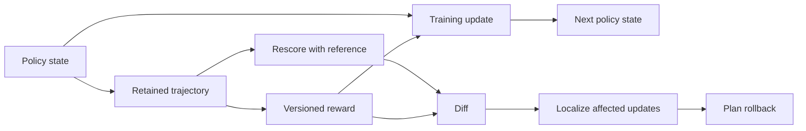

# Replayable Trajectory Dataflow (RTD)

**Audit historical reward measurements. Trace disagreements to training updates. Plan a rollback without new rollouts.**

[Camera-ready paper](paper/RTD-AIMS-COLM2026.pdf) · [LaTeX source](paper/camera-ready-source.zip) · [AIMS @ COLM 2026](https://aimslab.stanford.edu/workshop) · [Citation](CITATION.cff)

RTD is a Python library for retaining trajectory evidence and querying its training lineage. Given a corrected verifier, it rescans the outputs that were actually scored, identifies measurement disagreements, and selects a reference-unaffected recovery checkpoint. Recovery uses fresh rollouts under the corrected verifier.

This repository accompanies **“Replayable Trajectory Dataflow: Auditing Reward Measurement under Optimization and Drift in RLVR”**, by **Zepeng Zhang, The University of Osaka**, at the AI Measurement Science workshop at COLM 2026. The workshop is non-archival.

## Try it in one minute

Python 3.9+; no GPU or model download. The runtime uses only the Python standard library.

```bash
git clone https://github.com/PeterWrighten/rtd.git
cd rtd
python3 -m venv .venv
source .venv/bin/activate
python -m pip install -e '.[test]'
python examples/verifier_regression.py
python -m pytest -q
```

The example captures a synthetic 40-update history, switches to a substring-based verifier at update 18, and queries the retained evidence. It performs **no model training** and is not a reproduction of the paper's empirical results.

```text
Trajectories:           80
Measurement mismatches: 23
First affected update: 18
Rollback checkpoint:   15
Affected updates:      23
New diagnostic rollouts: 0
```

By default, the example uses a temporary directory. To keep its JSONL records and inspect the complete recovery plan:

```bash
python examples/verifier_regression.py --store runs/demo --json
```

The supplied directory must be empty or new. Checkpoint paths in this synthetic example are illustrative; it does not write model weights.

## How it works



| Operation | What it answers |
| --- | --- |
| `rescore` | What would the pinned reference report on these stored outputs? |
| `diff` | Which recorded measurements disagree with that reference? |
| `localize` | Which consumed updates and later training states depend on the mismatches? |
| `plan_recovery` | What is the latest saved checkpoint before the affected window? |

Retain the non-reconstructable evidence needed for the intended query: outputs, recorded rewards, measurement versions, sampling configuration and relevant engine signals. Recompute derived quantities only when their inputs and execution dependencies are available. Ordinary re-sampling is not a guarantee of exact historical reconstruction.

## Query an existing capture

```python
import rtd

store = rtd.open_store("runs/demo")

def corrected_verifier(trajectory):
    return float(trajectory.response == str(trajectory.ground_truth))

rescored = rtd.rescore(store, corrected_verifier, reference_id="exact-v1")
mismatches = rtd.diff(store, rescored)
graph = rtd.LineageGraph.build(store)
closure = rtd.localize(graph, mismatches)
plan = rtd.plan_recovery(graph, closure, reference_id="exact-v1")
print(plan.to_dict())
```

`diff` defaults to pass/fail disagreement at 0.5. For scalar-value differences, supply `predicate=rtd.value_predicate(tol=1e-6)`. Give changed references a new `reference_id`. Rescore caches assume a fixed store snapshot; set `use_cache=False` if records have been appended since the last query.

## Capture from a training loop

```python
import rtd

with rtd.run("runs/experiment", framework="custom", algorithm="grpo") as run:
    state = run.capture_checkpoint(step=0, path="checkpoints/initial")
    trajectory = run.capture_rollout(
        step=1, prompt="20 + 22 = ?", response="42", ground_truth=42,
        policy_ckpt=state, engine_version="your-engine-version",
        sampling_config={"temperature": 1.0},
    )
    reward = run.capture_signal(
        trajectory, value=1.0, source_id="verifier", source_version="exact-v1",
    )
    update = run.capture_update(
        step=1, signals=[reward], trajs=[trajectory], parent_ckpt=state,
    )
    state = run.capture_checkpoint(step=1, update=update, path="checkpoints/step1")
```

Capture records existing events; it does not run an optimizer or save model weights. Checkpoint steps denote post-update states. Record a logical state after each update; use an empty checkpoint `path` when that state was not saved. A nonempty path declares a recoverable checkpoint and must include the state your trainer needs to restart. Use a fresh directory for each run and a single writer; close or flush capture before diagnosis. The JSONL backend buffers trajectories and is not a crash-durable or tamper-evident store.

## Paper results and release scope

| Evidence in the paper | Reported result | Qualification |
| --- | --- | --- |
| Controlled subgroup regression | 0.43 affected-slice accuracy versus 0.87 overall; affected slice is 13.7% of prompts | Controlled GRU experiment |
| VeRL / Qwen2.5-Math-1.5B on MATH | 41,600 trajectories queried in 2.99 seconds | One injected incident; excludes process startup/store opening |
| Recovery in that incident | 62.5% from checkpoint 60 versus 0% from the latest checkpoint after 40 new updates | Final 320-trajectory training batch, not held-out MATH accuracy |

The completed **VeRL + Qwen2.5-Math + MATH + GRPO** experiment has its own [evidence and recipe](experiments/verl_math/README.md). This includes hash-checked compact results, historical reward/ingestion code, and a portable training launcher. Verify the saved summaries on CPU:

```bash
python experiments/verl_math/verify_results.py
```

A later checkpoint-80 recovery reaches **76.25%** on its final training batch. Its independent artifact audit is partial; it is supplementary evidence that excluding disputed ancestry does not maximize recovery accuracy. The actor is initialized from Qwen2.5-Math-1.5B Base; the faulty phase and recovery reuse an Instruct run configuration.

**Included here:** core capture/query library, synthetic CPU demonstration, regression tests, compact VeRL evidence and training recipe, camera-ready PDF and matching LaTeX source.

The complete GRU suite, raw incident stores, historical environment locks and model checkpoints are not bundled. The result checker recalculates saved summaries; the new launcher has not been tested in a fresh GPU training run. This release is not a self-contained exact reproduction archive.

## Boundaries of this implementation

- A reference is required. Failures shared by that reference are invisible to disagreement queries; retained evidence can be re-examined when a better reference becomes available.
- Closure is conservative dependency tracking, not proof that every downstream parameter changed or every checkpoint performs poorly.
- The current closure implementation assumes **one sequential training history with uniquely ordered update steps** and propagates from onset by step order. The paper's general branched-DAG contract is not implemented here. Keep independent branches in separate stores.
- For each queried signal kind, capture one consumed measurement per trajectory. The current `diff` selects the last recorded signal of that kind; it does not resolve multiple competing measurements by consumption.
- No affected update means no rollback; no saved checkpoint before onset means restart is required. The library does not verify checkpoint files or execute recovery.
- Diagnosis can run on CPU for a CPU reference. Recomputing model probabilities still requires model execution. RTD does not make stale trajectories suitable for off-policy training.

## Repository layout

```text
src/rtd/       Capture, append-only JSONL storage, lineage and diagnosis
examples/      Runnable synthetic verifier-regression demonstration
tests/         Diagnosis, recovery-boundary and experiment-artifact tests
experiments/   Completed VeRL incident evidence and training recipe
paper/         Camera-ready PDF and LaTeX source archive
CITATION.cff   Paper citation metadata
LICENSE        Apache License 2.0 for the software
```

## Citation and license

```bibtex
@inproceedings{zhang2026rtd,
  title = {Replayable Trajectory Dataflow: Auditing Reward Measurement under Optimization and Drift in RLVR},
  author = {Zhang, Zepeng},
  booktitle = {AI Measurement Science Workshop at COLM},
  year = {2026},
  note = {Non-archival workshop paper},
  url = {https://github.com/PeterWrighten/rtd}
}
```

The software is licensed under [Apache-2.0](LICENSE), as specified in the package metadata. The paper is supplied as the author's camera-ready manuscript; the software license does not grant additional rights to third-party material cited in it.
